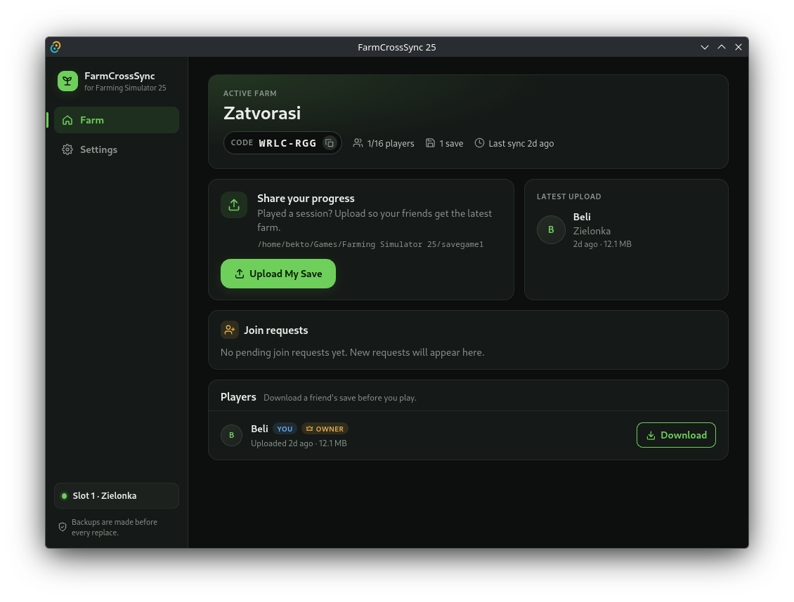

# Farm CrossSync 25

A desktop app and cloud backend for sharing Farming Simulator 25 savegames
between players on a multiplayer farm. One player uploads their latest save;
everyone else on the farm downloads it — with validation, hash verification,
and automatic local backups before anything is replaced.



- **Desktop app** (`FarmCrossSync25-app/`): Tauri 2 (Rust) + SvelteKit/Svelte 5
  + TypeScript. Discovers FS25 saves, packs and hashes them, syncs per-farm
  slots, and keeps session tokens in OS secure storage.
- **Backend** (`FarmCrossSync25-backend/`): Cloudflare Worker (Hono,
  TypeScript) with D1 for identity/farms/membership/save metadata and R2 for
  the save archives. Save bytes never pass through the Worker — the app
  uploads/downloads directly to/from R2 using short-lived presigned URLs
  issued by the API.

The desktop app embeds only an API base URL. **No secrets ship in the app or
in this repository** — R2 credentials live in Cloudflare Worker secret
storage, and local dev secrets (`.dev.vars`, `.env*`) are gitignored.

## Repository layout

| Path | What it is | Stack |
| --- | --- | --- |
| `FarmCrossSync25-app/` | Desktop application: UI, FS25 save handling, local sync state | SvelteKit + Svelte 5 + TypeScript, Tauri 2 (Rust) |
| `FarmCrossSync25-app/src/` | Frontend (SvelteKit) | `src/lib` services + tests, `src/routes` screens |
| `FarmCrossSync25-app/src-tauri/` | Native side: FS25 discovery, hashing, backup, safe replace, secure identity storage | Rust |
| `FarmCrossSync25-backend/` | Cloud API: identity, farms, membership, save metadata, R2 transfer authorization | Hono on Cloudflare Workers, D1 + R2 |
| `specs/farm-crosssync-25/` | Product and system specifications | `SPEC.md`, `DESIGN.md`, `systems/` |
| `docs/` | Durable product documentation | |

Each project has its own detailed README (`FarmCrossSync25-app/README.md`,
`FarmCrossSync25-backend/README.md`). The sections below are the shortest path
from a clean clone to a running app talking to a running backend.

## Prerequisites

- Node.js 22+
- Rust stable toolchain (`cargo`, `clippy`)
- Tauri 2 platform dependencies (Linux:
  `libwebkit2gtk-4.1-dev libayatana-appindicator3-dev librsvg2-dev`)
- For backend deployment: a Cloudflare account (`npx wrangler login`)

## 1. Set up the backend (local, no Cloudflare account needed)

```bash
cd FarmCrossSync25-backend
npm install
npx wrangler d1 migrations apply DB --local   # create the local D1 schema
npm run dev                                   # Worker on http://localhost:8787
```

Verify:

```bash
curl http://localhost:8787/health             # {"status":"ok"}
```

Local development runs against Wrangler's simulated D1 and R2 on disk
(`.wrangler/state/`, gitignored). No Cloudflare login, credentials, or
`.dev.vars` are required for local work.

## 2. Run the app against that backend

```bash
cd FarmCrossSync25-app
npm install
npm run dev            # Vite dev server
npm run tauri dev      # full desktop app shell (preferred)
```

The app defaults to the `local` environment, i.e. `http://localhost:8787` —
so with the backend from step 1 running, no further configuration is needed.

## 3. Configure which backend the app talks to

`FarmCrossSync25-app/src/lib/config.ts` is the single source of truth for the
API host. The client embeds only a base URL — never secrets.

| Variable | Meaning |
| --- | --- |
| `VITE_APP_ENV` | `local` (default) \| `staging` \| `production` — selects the API host |
| `VITE_API_BASE_URL` | Optional per-build override of the host, without editing code |

Both are read at build time (statically inlined by Vite). For a packaged
build to reach a real deployment, two things must be updated in source and
committed:

1. `API_BASE_URLS` in `FarmCrossSync25-app/src/lib/config.ts` — replace the
   staging/production hosts with your deployed Worker URL(s).
2. The `connect-src` allowlist in **both** `app.security.csp` and
   `app.security.devCsp` of `FarmCrossSync25-app/src-tauri/tauri.conf.json` —
   the CSP is compiled into the binary; a URL missing from it is blocked at
   runtime even if the env var is set correctly. Keep
   `https://*.r2.cloudflarestorage.com` (presigned archive transfers) and
   `http://localhost:8787` (local dev) in the list.

## 4. Deploy the backend (Cloudflare production)

Run from `FarmCrossSync25-backend/`:

```bash
npm install
npx wrangler login
npx wrangler d1 create farm-crosssync-db        # put the printed database_id
                                                # into wrangler.jsonc, replacing
                                                # the 00000000-... placeholder
npx wrangler r2 bucket create farm-crosssync-saves
npx wrangler d1 migrations apply DB --remote    # apply schema to remote D1
npx wrangler secret put R2_ACCOUNT_ID           # R2 S3 API credentials —
npx wrangler secret put R2_ACCESS_KEY_ID        # all four are required, see
npx wrangler secret put R2_SECRET_ACCESS_KEY    # backend README "Presigned URL
npx wrangler secret put R2_BUCKET               # mechanism" for where they come from
npm run deploy                                  # runs the deploy guard first
```

`npm run deploy` refuses to ship a broken configuration: the deploy guard
(`scripts/deploy-guard.mjs`) aborts on development-only vars, a placeholder
D1 database id, placeholder URLs, or missing R2 secrets. The dev-only
`/r2-test/*` route can never be reached in a deployed Worker.

Then smoke-test:

```bash
curl https://<your-worker>.workers.dev/health   # {"status":"ok"}
```

The backend README covers staging vs production environments, custom domains,
`MAX_SAVE_SIZE_BYTES`, and the full API reference.

## 5. Build installers against the backend data

```bash
cd FarmCrossSync25-app
npm ci
VITE_APP_ENV=production npm run tauri build
```

- Production config: `VITE_APP_ENV=production` selects the `production`
  `API_BASE_URLS` entry (omit it and the build embeds `localhost:8787`).
- Bundle targets are configured in `src-tauri/tauri.conf.json`:
  `nsis` (Windows installer) and `appimage` (Linux).
- Installers land under `src-tauri/target/<profile>/bundle/`:
  - `nsis/FarmCrossSync25_<version>_x64-setup.exe`
  - `appimage/FarmCrossSync25_<version>_amd64.AppImage`
- Linux AppImage builds may need `NO_STRIP=1` (the release profile sets
  `strip = true`).
- Web bundle only: `npm run build` (static adapter output in `build/`).

No secrets are embedded in either installer: the app bundle contains only the
frontend assets and the base URL selected above.

## Verification

```bash
# Desktop app
cd FarmCrossSync25-app
npm run check                              # svelte-check (typecheck)
node --test src/lib/*.test.ts              # TypeScript unit tests
npm run build                              # production web build
cargo test  --manifest-path src-tauri/Cargo.toml
cargo clippy --manifest-path src-tauri/Cargo.toml --all-targets -- -D warnings

# Backend
cd ../FarmCrossSync25-backend
npm run typecheck
npm test
```

End-to-end suites (each starts its own local Worker):

```bash
cd FarmCrossSync25-app
npm run upload:e2e
npm run download:e2e
npm run reliability:e2e
npm run lifecycle:e2e
```

CI (`.github/workflows/ci.yml`) runs the typecheck, lint, test, and build
checks above for both projects on every push and pull request.

## Security posture

- The client embeds only an API base URL; R2 credentials exist solely in
  Worker secret storage. Session tokens live in OS secure storage (keyring,
  with a `0600` file fallback) and are stored server-side only as SHA-256
  hashes with a 30-day expiry.
- Restrictive CSP (`script-src 'self'` in production; dev relaxations are
  scoped to `devCsp`) and a minimal Tauri capability set (`core:default` +
  `dialog:default` only — no arbitrary filesystem or HTTP access from the
  webview).
- Save downloads are hash-verified and local saves are backed up before any
  replacement; an interrupted or failed operation never overwrites good data.
- The development-only `/r2-test/*` route is fail-closed (env markers +
  loopback host) and blocked at deploy time by the deploy guard.
